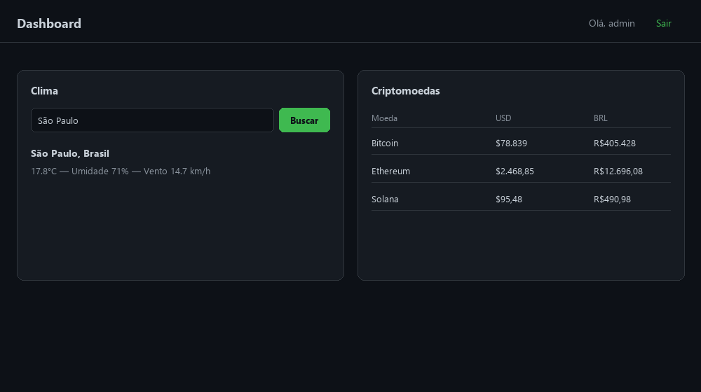

# webdash

Mini dashboard web (Flask + HTML/CSS/JS) com login e dados em tempo real de
clima e criptomoedas, consumidos de APIs públicas gratuitas (sem chave de API).



## Segurança aplicada

- Senha do usuário nunca é armazenada em texto puro — só o hash
  (`werkzeug.security.generate_password_hash`).
- Cookie de sessão com `HttpOnly` e `SameSite=Lax` (e `Secure` em produção).
- Rate limiting no login (5 tentativas/min) e nas rotas de API (20 req/min),
  via `Flask-Limiter`, para dificultar força bruta e abuso.
- Validação de entrada do usuário (nome da cidade) com whitelist de
  caracteres, evitando injeção de dados inesperados nas chamadas de API.
- Headers de segurança HTTP aplicados em toda resposta (`X-Frame-Options`,
  `X-Content-Type-Options`, `Referrer-Policy`, `Content-Security-Policy`) —
  as mesmas boas práticas que o [websec-scanner](https://github.com/Kaua-Kanin/websec-scanner)
  verifica.
- Rotas de dashboard e API protegidas por login (`@login_required`).

## Instalação

```bash
pip install -r requirements.txt
cp .env.example .env
```

Gere o hash da sua senha e coloque em `.env` (`DASHBOARD_PASSWORD_HASH`):

```bash
python -c "from werkzeug.security import generate_password_hash; print(generate_password_hash('sua-senha-aqui'))"
```

## Uso

```bash
python app.py
```

Acesse `http://127.0.0.1:5000`, faça login com o usuário/senha configurados
em `.env`, e use o dashboard para consultar clima por cidade e preços atuais
de Bitcoin, Ethereum e Solana.

## Stack

- **Back-end**: Flask, Flask-Limiter
- **Front-end**: HTML/CSS/JavaScript puro (sem framework)
- **APIs públicas**: [Open-Meteo](https://open-meteo.com/) (clima, sem chave)
  e [CoinGecko](https://www.coingecko.com/pt/api) (criptomoedas, sem chave)

## Roadmap

- [ ] Persistir usuários em banco de dados (hoje é um único admin via `.env`)
- [ ] Adicionar CSRF token no formulário de login
- [ ] Cache de respostas das APIs externas
